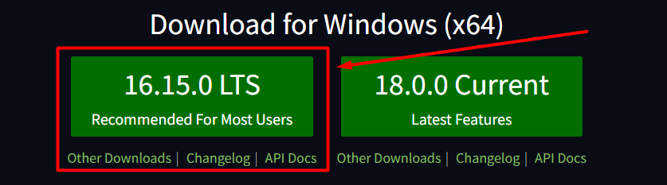
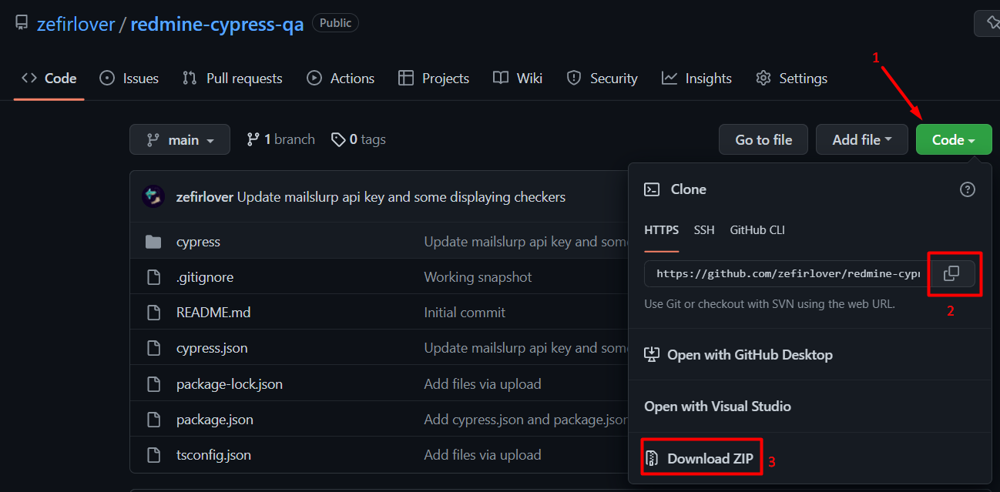
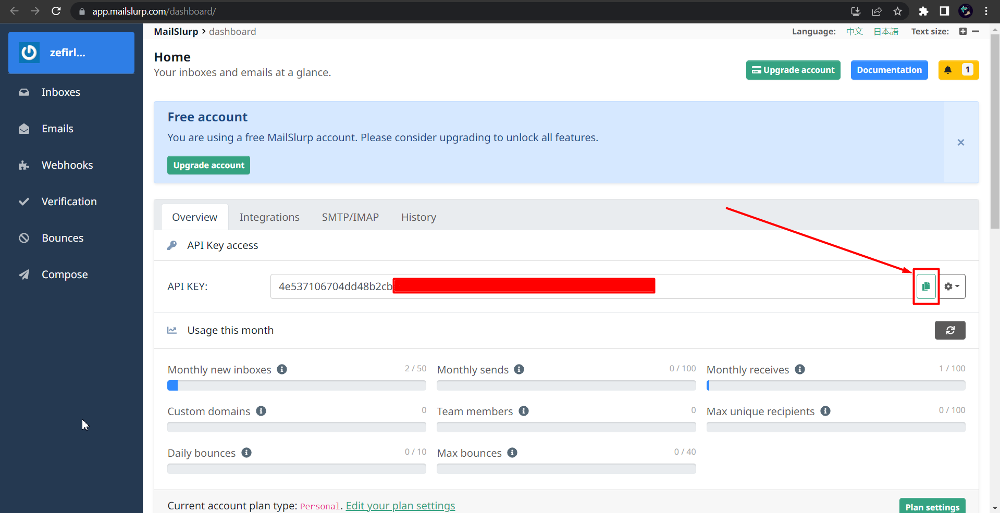

# redmine-cypress-qa
This is TypeScript Cypress automation tests created to test some functionality 
of the Redmine website: https://www.redmine.org/

Test cases for this project you can find here: 
https://docs.google.com/spreadsheets/d/1AZDOpS8saBpcd3_K3DfL9QwreeZxXvF3Oqi15YjK11s/edit?usp=sharing

## Project installation
You need to install a Node.js LTS:
Using this reference: https://nodejs.org/en/

Then, you can download the project.
Click the "code" button. You can download ZIP archive on your PC, or instead use the `git clone`
command in Command Prompt.

After that open the command prompt in the project folder and run the
`npm install`, and then execute the `npm i cypress typescript cypress-mailslurp mailslurp-client mailslurp --save-dev` command.

To get more info about Cypress you can use this link:
https://docs.cypress.io/guides/getting-started/installing-cypress#Environment-variables

### Set up the Mailslurp

The Mailslurp add-on is used to generate fake emails for autotests.
To use it, you need to register here: https://app.mailslurp.com/sign-up/.

Also, you can use your Google or GitHub account to log in.

After the logging in, you can see main page with your unique API KEY:

Click on 'copy' button and paste it in `cypress.json` file to the MAILSLURP_API_KEY field in "",
where the current key is placed. **NOTE**, on the free account you can only generate 50 inboxes per month.

You can see all generated inboxes here: https://app.mailslurp.com/inboxes/

And all received emails here: https://app.mailslurp.com/emails/

## How to start your tests
To run the tests you can use the `npx cypress run` command or if you want to open
the Cypress UI you can use the `npx cypress open` command. Please, be sure that
your npx is installed. It can be pre-installed with npm > v.5.2 or installed separately.

To get more variants to start your cypress tests or more information about cypress
visit this page: https://docs.cypress.io/guides/getting-started/installing-cypress#Opening-Cypress